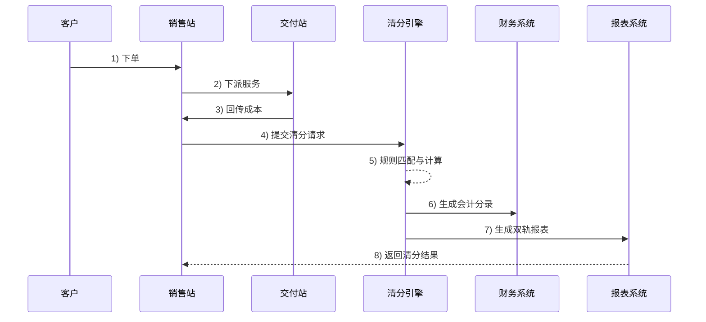
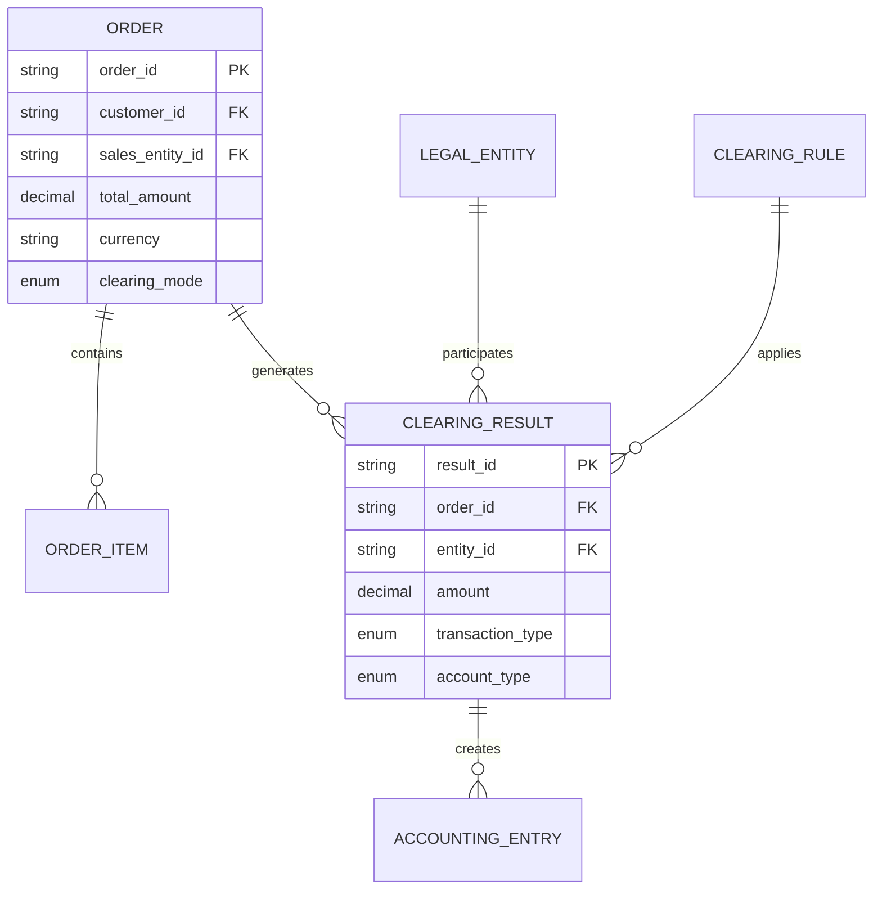

# OneOrder财务清分系统

## 系统概述

OneOrder是一个专为跨境物流行业设计的财务清分系统，支持复杂的多法人体清分场景，包括借抬头、过账、净额抵消等业务需求。系统采用星式和链式两种清分模式，能够灵活处理各种业务场景。

### 核心特性

- **四类法人体模型**：客户、销售站、交付站、供应商的统一抽象
- **双轨并行**：管理报表与法定报表分离处理
- **智能路由**：支持借抬头、过账等复杂场景
- **星式优先**：避免资金空转，提高效率
- **可视化管理**：规则配置和清分路径可视化
- **差异监控**：自动检测并标记管报法报差异

## 技术架构

### 后端技术栈

- **框架**: Spring Boot 2.7.14
- **数据库**: PostgreSQL 14
- **缓存**: Redis 7
- **消息队列**: RabbitMQ 3.12
- **规则引擎**: Drools 8.40
- **API文档**: OpenAPI 3 (Swagger)
- **构建工具**: Maven 3.8+

### 前端技术栈

- **框架**: 原生HTML5 + JavaScript
- **UI库**: Bootstrap 5.1.3
- **图标**: Font Awesome 6.0
- **图表**: Chart.js (可选)
- **可视化**: D3.js (清分路径图)

### 部署架构

- **容器化**: Docker + Docker Compose
- **反向代理**: Nginx
- **监控**: Spring Boot Actuator
- **日志**: Logback + 文件滚动

## 系统模块

### 1. 清分引擎模块
- 星式清分算法
- 链式清分算法
- 清分结果验证
- 试算功能

### 2. 规则引擎模块
- 借抬头规则处理
- 过账规则处理
- 净额抵消规则
- 分润规则配置

### 3. 财务核算模块
- 会计分录生成
- 凭证管理
- 自动过账
- 科目余额查询

### 4. 报表生成模块
- 管理报表生成
- 法定报表生成
- 差异对照报表
- 清分路径可视化

## 快速开始

### 环境要求

- JDK 11+
- Maven 3.6+
- Docker 20.10+
- Docker Compose 2.0+

### 本地开发环境搭建

1. **克隆项目**
```bash
git clone <repository-url>
cd OneOrder
```

2. **启动基础服务**
```bash
# 启动PostgreSQL、Redis、RabbitMQ
docker-compose up -d postgres redis rabbitmq
```

3. **配置数据库**
```bash
# 等待数据库启动完成
sleep 30

# 运行数据库迁移（如果使用Flyway）
mvn flyway:migrate
```

4. **编译运行**
```bash
# 编译项目
mvn clean compile

# 运行应用
mvn spring-boot:run
```

5. **访问系统**
- 应用地址: http://localhost:8080/api
- API文档: http://localhost:8080/api/swagger-ui.html
- 前端界面: http://localhost:8080

### Docker部署

1. **一键启动所有服务**
```bash
# 构建并启动所有服务
docker-compose up -d

# 查看服务状态
docker-compose ps

# 查看日志
docker-compose logs -f oneorder-app
```

2. **访问服务**
- 应用地址: http://localhost
- API文档: http://localhost/api/swagger-ui.html
- PostgreSQL: localhost:5432
- Redis: localhost:6379
- RabbitMQ管理界面: http://localhost:15672

## 业务流程

### 清分流程



### 星式vs链式清分

#### 星式清分（推荐）
- 收款法人一次性分配
- 避免资金空转
- 提高处理效率
- 适用于大部分场景

#### 链式清分
- 按派单路径逐层清分
- 严格遵循业务流程
- 可能产生资金闭环
- 适用于合规要求场景

## API接口

### 清分管理接口

```http
POST /api/clearing/execute
Content-Type: application/json

{
  "order": {
    "orderId": "ORD-2024-0001",
    "orderNo": "TEST-001",
    "customerId": "CUSTOMER001",
    "salesEntityId": "SALES001",
    "totalAmount": 10000.00,
    "currency": "CNY",
    "clearingMode": "STAR"
  },
  "isSimulation": false,
  "operator": "admin"
}
```

### 报表生成接口

```http
POST /api/reports/management
Content-Type: application/json

{
  "startTime": "2024-01-01T00:00:00",
  "endTime": "2024-01-31T23:59:59",
  "entityIds": ["SALES001", "DELIVERY001"],
  "currencies": ["CNY", "USD"],
  "groupBy": "ENTITY"
}
```

## 配置说明

### 应用配置

```yaml
# application.yml
clearing:
  default-mode: star
  profit-sharing:
    default-rate: 0.5
  transit-entity:
    default-retention-rate: 0.03
  cross-border:
    enable-netting: true
    netting-threshold: 10000
```

### 规则配置示例

```json
{
  "ruleId": "RULE001",
  "ruleName": "香港借抬头规则",
  "ruleType": "TRANSIT_ENTITY",
  "ruleConfig": {
    "transitEntityId": "DELIVERY003",
    "retentionRate": 0.03,
    "applicableType": "RECEIVABLE"
  },
  "conditionExpression": "${order.currency} == 'USD'",
  "priority": 1,
  "isActive": true
}
```

## 数据模型

### 核心实体关系



## 监控与运维

### 健康检查

```bash
# 应用健康状态
curl http://localhost:8080/api/actuator/health

# 数据库连接状态
curl http://localhost:8080/api/actuator/health/db

# Redis连接状态
curl http://localhost:8080/api/actuator/health/redis
```

### 日志管理

```bash
# 查看应用日志
docker-compose logs -f oneorder-app

# 查看数据库日志
docker-compose logs -f postgres

# 查看Nginx访问日志
docker-compose exec nginx tail -f /var/log/nginx/access.log
```

### 性能监控

- JVM指标: `/api/actuator/metrics`
- 数据库连接池: `/api/actuator/metrics/hikaricp.connections`
- HTTP请求统计: `/api/actuator/metrics/http.server.requests`

## 开发指南

### 添加新的清分规则

1. 在`ClearingRule.RuleType`枚举中添加新类型
2. 在`RuleEngineImpl`中实现规则处理逻辑
3. 添加相应的单元测试
4. 更新API文档

### 扩展报表功能

1. 创建新的报表DTO类
2. 在`ReportService`中添加生成方法
3. 在`ReportController`中添加API接口
4. 更新前端页面

### 自定义会计科目

1. 修改`AccountingServiceImpl`中的科目映射
2. 更新数据库初始化脚本
3. 调整报表生成逻辑

## 常见问题

### Q: 清分结果不平衡怎么办？
A: 检查清分规则配置，确保借贷双方金额一致。可以使用试算功能验证结果。

### Q: 如何处理多币种场景？
A: 系统支持多币种，但需要注意汇率换算。建议在规则引擎中配置汇率转换规则。

### Q: 管报和法报差异如何配置？
A: 通过`RETENTION`类型规则配置不同口径的分润比例，系统会自动生成差异报表。

### Q: 如何备份和恢复数据？
A: 使用PostgreSQL的pg_dump和pg_restore工具，或者通过Docker卷备份。

## 许可证

本项目采用 MIT 许可证。详见 [LICENSE](LICENSE) 文件。

## 贡献指南

1. Fork 项目
2. 创建特性分支 (`git checkout -b feature/AmazingFeature`)
3. 提交更改 (`git commit -m 'Add some AmazingFeature'`)
4. 推送到分支 (`git push origin feature/AmazingFeature`)
5. 打开 Pull Request

## 联系我们

- 项目维护者: OneOrder Team
- 邮箱: oneorder@example.com
- 问题反馈: [GitHub Issues](https://github.com/oneorder/issues)