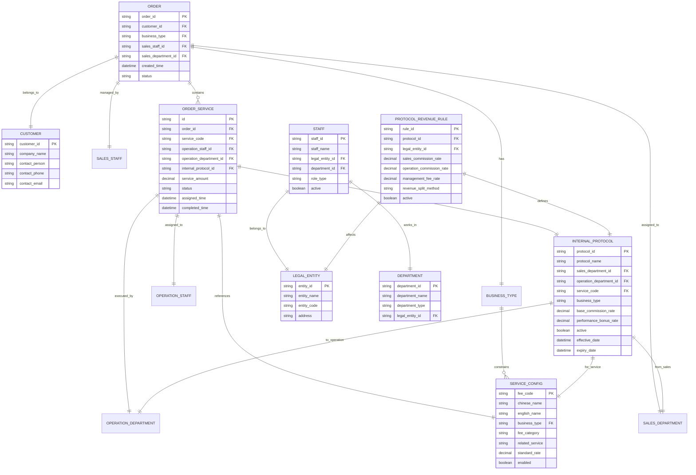

# OneOrder接单派单流程PRD设计文档

## 1. 产品概述

### 1.1 背景
OneOrder货代订单管理系统需要实现完整的接单派单流程，确保从客户下单到具体操作人员执行的全链路可追溯管理。

### 1.2 目标
- 建立标准化的接单派单流程
- 实现订单-服务-人员的三级管理体系
- 确保每个服务环节都有明确的责任人
- 支持跨部门协作的业务场景
- 建立基于内部协议的分润机制
- 实现销售部门与操作部门的协议匹配

## 2. 业务流程设计

### 2.1 核心业务实体关系



### 2.2 业务流程步骤

#### 步骤1: 接单阶段
1. **客服接单**
   - 客服选择客户
   - 确定业务类型(OCEAN/AIR/TRUCK/RAIL/CUSTOMS/WAREHOUSE)
   - 系统根据业务类型约束可选服务项
   - 客服选定具体包含的服务
   - 生成订单，客服成为订单负责人

#### 步骤2: 派单阶段
2. **服务派单与协议匹配**
   - 对每个选定的服务，客服指派操作人员
   - 系统根据客服部门和操作部门自动匹配可用的内部协议
   - 客服在可用协议中选择合适的协议
   - 系统自动关联操作人员所属部门
   - 生成服务任务，操作人员成为服务负责人
   - 发送派单通知（包含协议信息）

#### 步骤3: 执行确认
3. **操作接单与协议确认**
   - 操作人员接收任务通知
   - 查看任务详情和对应的内部协议条款
   - 操作人员接单时自动确认内部协议
   - 协议正式生效，后续影响分润计算

#### 步骤4: 执行跟踪
4. **执行监控与分润准备**
   - 操作人员按协议执行服务
   - 实时更新服务执行状态
   - 客服跟踪整体订单进度
   - 系统记录分润相关数据
   - 支持跨部门协作沟通

## 3. 功能需求

### 3.1 订单管理功能

#### 3.1.1 创建订单
**功能描述**: 客服创建新订单并选择服务

**输入条件**:
- 客户信息(必选)
- 业务类型(必选): OCEAN/AIR/TRUCK/RAIL/CUSTOMS/WAREHOUSE
- 客服ID(系统自动获取当前登录用户)

**处理逻辑**:
1. 验证客服权限
2. 根据业务类型加载可选服务列表
3. 客服选择具体服务项
4. 计算预估费用
5. 生成订单号
6. 自动关联客服所属销售部门

**输出结果**:
- 订单创建成功
- 返回订单详情和可派单服务列表

#### 3.1.2 服务派单与协议匹配
**功能描述**: 客服将具体服务派给操作人员并选择内部协议

**输入条件**:
- 订单ID
- 服务编码列表
- 操作人员ID列表(一对一关系)

**处理逻辑**:
1. 验证客服是否为订单负责人
2. 验证操作人员是否有执行该服务的权限
3. 根据客服部门和操作部门匹配可用内部协议
4. 客服选择具体的内部协议
5. 自动关联操作人员所属部门
6. 生成服务任务记录(包含协议信息)
7. 发送派单通知给操作人员

**输出结果**:
- 派单成功
- 生成服务任务列表(含协议)
- 发送通知确认

### 3.2 权限管理功能

#### 3.2.1 人员权限
- **客服权限**: 创建订单、选择服务、派单、跟踪进度
- **操作权限**: 接收任务、更新状态、完成服务
- **主管权限**: 查看部门所有订单和任务

#### 3.2.2 部门权限
- **销售部门**: 管理所有订单，派单权限
- **操作部门**: 接收和执行对应服务类型的任务
- **跨部门协作**: 支持服务依赖和流程传递

### 3.3 内部协议管理功能

#### 3.3.1 协议匹配
**功能描述**: 根据销售部门和操作部门自动匹配可用的内部协议

**输入条件**:
- 销售部门ID
- 操作部门ID  
- 服务编码
- 业务类型

**处理逻辑**:
1. 查询销售部门与操作部门之间的有效协议
2. 过滤匹配服务类型和业务类型的协议
3. 按协议生效时间和优先级排序
4. 返回可选协议列表

**输出结果**:
- 可用内部协议列表
- 协议详情(费率、分润规则等)

#### 3.3.2 协议确认
**功能描述**: 操作人员接单时确认内部协议

**输入条件**:
- 服务任务ID
- 操作人员ID

**处理逻辑**:
1. 验证操作人员身份
2. 展示协议条款和分润规则
3. 操作人员确认接单
4. 协议状态更新为"已确认"
5. 记录确认时间和操作人员信息

**输出结果**:
- 协议确认成功
- 更新服务任务状态
- 触发分润计算准备

#### 3.3.3 分润影响计算
**功能描述**: 基于确认的内部协议计算分润规则

**输入条件**:
- 已确认的内部协议
- 服务实际收入金额
- 成本费用

**处理逻辑**:
1. 读取协议中的分润规则
2. 计算销售部门应得佣金
3. 计算操作部门应得佣金
4. 计算管理费用分摊
5. 生成分润明细记录

**输出结果**:
- 分润计算结果
- 各部门应得收益
- 分润依据和计算过程

### 3.4 状态管理功能

#### 3.4.1 订单状态
- `DRAFT`: 草稿(创建中)
- `CONFIRMED`: 已确认(服务已选定)
- `IN_PROGRESS`: 执行中(部分服务已派单)
- `COMPLETED`: 已完成(所有服务完成)
- `CANCELLED`: 已取消

#### 3.4.2 服务状态
- `PENDING`: 待派单
- `ASSIGNED`: 已派单(待协议确认)
- `PROTOCOL_CONFIRMED`: 协议已确认
- `IN_PROGRESS`: 执行中
- `COMPLETED`: 已完成
- `BLOCKED`: 受阻

#### 3.4.3 协议状态
- `DRAFT`: 草稿(协议创建中)
- `ACTIVE`: 生效中
- `SELECTED`: 已选择(待确认)
- `CONFIRMED`: 已确认(生效)
- `EXPIRED`: 已过期
- `SUSPENDED`: 暂停

## 4. 界面设计

### 4.1 订单创建页面

#### 4.1.1 客户选择区域
```html
<!-- 客户信息选择 -->
<div class="form-group">
    <label>选择客户 *</label>
    <select id="customerId" class="form-select" required>
        <option value="">请选择客户</option>
        <!-- 动态加载客户列表 -->
    </select>
</div>
```

#### 4.1.2 业务类型选择区域
```html
<!-- 业务类型选择 -->
<div class="form-group">
    <label>业务类型 *</label>
    <select id="businessType" class="form-select" required onchange="loadAvailableServices()">
        <option value="">请选择业务类型</option>
        <option value="OCEAN">海运</option>
        <option value="AIR">空运</option>
        <option value="TRUCK">陆运</option>
        <option value="RAIL">铁运</option>
        <option value="CUSTOMS">关务</option>
        <option value="WAREHOUSE">仓储</option>
    </select>
</div>
```

#### 4.1.3 服务选择区域
```html
<!-- 服务选择区域 -->
<div id="serviceSelection" class="service-selection">
    <!-- 根据业务类型动态加载可选服务 -->
    <div class="service-category" data-category="跨境运输费用">
        <h6>跨境运输费用</h6>
        <div class="service-items">
            <!-- 动态生成服务复选框 -->
        </div>
    </div>
</div>
```

### 4.2 派单管理页面

#### 4.2.1 订单概览区域
```html
<!-- 订单基本信息 -->
<div class="order-summary">
    <div class="row">
        <div class="col-md-6">
            <p><strong>订单号:</strong> <span id="orderNumber"></span></p>
            <p><strong>客户:</strong> <span id="customerName"></span></p>
            <p><strong>业务类型:</strong> <span id="businessType"></span></p>
        </div>
        <div class="col-md-6">
            <p><strong>客服:</strong> <span id="salesStaff"></span></p>
            <p><strong>销售部门:</strong> <span id="salesDepartment"></span></p>
            <p><strong>创建时间:</strong> <span id="createTime"></span></p>
        </div>
    </div>
</div>
```

#### 4.2.2 服务派单区域
```html
<!-- 服务派单列表 -->
<div class="service-assignment">
    <table class="table table-hover">
        <thead>
            <tr>
                <th>服务代码</th>
                <th>服务名称</th>
                <th>费用分类</th>
                <th>预估金额</th>
                <th>指派操作</th>
                <th>操作部门</th>
                <th>内部协议</th>
                <th>状态</th>
                <th>操作</th>
            </tr>
        </thead>
        <tbody id="serviceAssignmentTable">
            <!-- 动态生成服务派单行 -->
        </tbody>
    </table>
</div>
```

#### 4.2.3 操作人员与协议选择模态框
```html
<!-- 操作人员与协议选择弹窗 -->
<div class="modal" id="staffAndProtocolSelectionModal">
    <div class="modal-dialog modal-lg">
        <div class="modal-content">
            <div class="modal-header">
                <h5>派单与协议选择</h5>
                <button type="button" class="btn-close" data-bs-dismiss="modal"></button>
            </div>
            <div class="modal-body">
                <!-- 基本信息 -->
                <div class="row mb-3">
                    <div class="col-md-6">
                        <label>服务类型:</label>
                        <span id="serviceTypeDisplay" class="fw-bold"></span>
                    </div>
                    <div class="col-md-6">
                        <label>销售部门:</label>
                        <span id="salesDepartmentDisplay" class="fw-bold"></span>
                    </div>
                </div>
                
                <!-- 选择操作人员 -->
                <div class="form-group mb-3">
                    <label>选择操作人员 *</label>
                    <select id="operationStaffSelect" class="form-select" onchange="loadAvailableProtocols()">
                        <option value="">请选择操作人员</option>
                        <!-- 根据服务类型筛选可选操作人员 -->
                    </select>
                </div>
                
                <!-- 操作人员信息 -->
                <div class="staff-info mb-3" id="staffInfoDisplay" style="display: none;">
                    <div class="card">
                        <div class="card-body">
                            <h6>操作人员信息</h6>
                            <div class="row">
                                <div class="col-md-6">
                                    <p><strong>姓名:</strong> <span id="staffName"></span></p>
                                    <p><strong>部门:</strong> <span id="operationDepartment"></span></p>
                                </div>
                                <div class="col-md-6">
                                    <p><strong>法人公司:</strong> <span id="legalEntity"></span></p>
                                    <p><strong>角色:</strong> <span id="roleType"></span></p>
                                </div>
                            </div>
                        </div>
                    </div>
                </div>
                
                <!-- 选择内部协议 -->
                <div class="form-group mb-3" id="protocolSelectionArea" style="display: none;">
                    <label>选择内部协议 *</label>
                    <div class="protocol-options" id="protocolOptions">
                        <!-- 动态生成协议选项 -->
                    </div>
                </div>
                
                <!-- 协议详情 -->
                <div class="protocol-details mb-3" id="protocolDetails" style="display: none;">
                    <div class="card">
                        <div class="card-body">
                            <h6>协议详情</h6>
                            <div class="row">
                                <div class="col-md-6">
                                    <p><strong>协议名称:</strong> <span id="protocolName"></span></p>
                                    <p><strong>基础佣金率:</strong> <span id="baseCommissionRate"></span>%</p>
                                </div>
                                <div class="col-md-6">
                                    <p><strong>绩效奖金率:</strong> <span id="performanceBonusRate"></span>%</p>
                                    <p><strong>生效期限:</strong> <span id="effectivePeriod"></span></p>
                                </div>
                            </div>
                            <div class="revenue-split-preview mt-2">
                                <h6>分润预览</h6>
                                <div class="row">
                                    <div class="col-md-4">
                                        <small>销售佣金率: <span id="salesCommissionPreview"></span>%</small>
                                    </div>
                                    <div class="col-md-4">
                                        <small>操作佣金率: <span id="operationCommissionPreview"></span>%</small>
                                    </div>
                                    <div class="col-md-4">
                                        <small>管理费率: <span id="managementFeePreview"></span>%</small>
                                    </div>
                                </div>
                            </div>
                        </div>
                    </div>
                </div>
            </div>
            <div class="modal-footer">
                <button type="button" class="btn btn-secondary" data-bs-dismiss="modal">取消</button>
                <button type="button" class="btn btn-primary" onclick="confirmStaffAndProtocolAssignment()" id="confirmAssignmentBtn" disabled>确认派单</button>
            </div>
        </div>
    </div>
</div>
```

#### 4.2.4 协议选择卡片模板
```html
<!-- 单个协议选项卡片 -->
<div class="protocol-card card mb-2" data-protocol-id="">
    <div class="card-body">
        <div class="form-check">
            <input class="form-check-input" type="radio" name="protocolSelection" onchange="showProtocolDetails('')">
            <label class="form-check-label">
                <div class="protocol-summary">
                    <h6 class="protocol-title"></h6>
                    <div class="protocol-rates">
                        <small class="text-muted">
                            基础佣金: <span class="base-rate"></span>% | 
                            绩效奖金: <span class="bonus-rate"></span>% | 
                            有效期: <span class="validity"></span>
                        </small>
                    </div>
                </div>
            </label>
        </div>
    </div>
</div>
```

### 4.3 任务执行页面

#### 4.3.1 我的任务列表
```html
<!-- 操作人员任务列表 -->
<div class="task-list">
    <div class="d-flex justify-content-between align-items-center mb-3">
        <h5>我的任务</h5>
        <div class="task-filters">
            <select id="statusFilter" class="form-select form-select-sm">
                <option value="">所有状态</option>
                <option value="ASSIGNED">已派单</option>
                <option value="IN_PROGRESS">执行中</option>
                <option value="COMPLETED">已完成</option>
            </select>
        </div>
    </div>
    
    <div class="task-cards" id="taskCardContainer">
        <!-- 动态生成任务卡片 -->
    </div>
</div>
```

#### 4.3.2 任务详情卡片(含协议信息)
```html
<!-- 单个任务卡片模板 -->
<div class="task-card card mb-3" data-task-id="">
    <div class="card-header d-flex justify-content-between">
        <span class="task-title"></span>
        <span class="task-status badge"></span>
    </div>
    <div class="card-body">
        <div class="row">
            <div class="col-md-8">
                <p><strong>订单号:</strong> <span class="order-number"></span></p>
                <p><strong>客户:</strong> <span class="customer-name"></span></p>
                <p><strong>服务:</strong> <span class="service-name"></span></p>
                <p><strong>派单时间:</strong> <span class="assign-time"></span></p>
            </div>
            <div class="col-md-4">
                <p><strong>客服:</strong> <span class="sales-staff"></span></p>
                <p><strong>预估金额:</strong> <span class="estimated-amount"></span></p>
                <div class="task-actions">
                    <button class="btn btn-sm btn-warning" onclick="viewProtocolDetails('')" data-status="ASSIGNED">查看协议</button>
                    <button class="btn btn-sm btn-primary" onclick="confirmProtocolAndStart('')" data-status="ASSIGNED">确认接单</button>
                    <button class="btn btn-sm btn-primary" onclick="startTask('')" data-status="PROTOCOL_CONFIRMED" style="display:none;">开始执行</button>
                    <button class="btn btn-sm btn-success" onclick="completeTask('')" data-status="IN_PROGRESS" style="display:none;">完成任务</button>
                </div>
            </div>
        </div>
        
        <!-- 协议信息区域 -->
        <div class="protocol-info mt-3" data-status="ASSIGNED">
            <div class="card bg-light">
                <div class="card-body">
                    <h6 class="card-title text-primary">
                        <i class="fas fa-handshake me-2"></i>内部协议信息
                    </h6>
                    <div class="row">
                        <div class="col-md-6">
                            <p><small><strong>协议名称:</strong> <span class="protocol-name"></span></small></p>
                            <p><small><strong>基础佣金率:</strong> <span class="base-commission-rate"></span>%</small></p>
                        </div>
                        <div class="col-md-6">
                            <p><small><strong>绩效奖金率:</strong> <span class="performance-bonus-rate"></span>%</small></p>
                            <p><small><strong>分润方式:</strong> <span class="revenue-split-method"></span></small></p>
                        </div>
                    </div>
                    <div class="protocol-warning alert alert-warning py-2 mt-2">
                        <small><i class="fas fa-exclamation-triangle me-1"></i>
                        <strong>提示:</strong> 确认接单即表示同意此内部协议条款，协议将影响后续分润计算。</small>
                    </div>
                </div>
            </div>
        </div>
        
        <!-- 协议已确认状态 -->
        <div class="protocol-confirmed mt-3" data-status="PROTOCOL_CONFIRMED" style="display:none;">
            <div class="alert alert-success py-2">
                <small><i class="fas fa-check-circle me-1"></i>
                <strong>协议已确认:</strong> <span class="confirmed-protocol-name"></span> 
                (确认时间: <span class="protocol-confirm-time"></span>)</small>
            </div>
        </div>
    </div>
</div>
```

#### 4.3.3 协议详情查看模态框
```html
<!-- 协议详情查看弹窗 -->
<div class="modal" id="protocolDetailsModal">
    <div class="modal-dialog modal-lg">
        <div class="modal-content">
            <div class="modal-header">
                <h5>内部协议详情</h5>
                <button type="button" class="btn-close" data-bs-dismiss="modal"></button>
            </div>
            <div class="modal-body">
                <!-- 协议基本信息 -->
                <div class="protocol-basic-info mb-4">
                    <h6 class="text-primary">协议基本信息</h6>
                    <div class="row">
                        <div class="col-md-6">
                            <p><strong>协议名称:</strong> <span id="modalProtocolName"></span></p>
                            <p><strong>协议编号:</strong> <span id="modalProtocolId"></span></p>
                            <p><strong>业务类型:</strong> <span id="modalBusinessType"></span></p>
                        </div>
                        <div class="col-md-6">
                            <p><strong>服务类型:</strong> <span id="modalServiceCode"></span></p>
                            <p><strong>生效期间:</strong> <span id="modalEffectivePeriod"></span></p>
                            <p><strong>协议状态:</strong> <span id="modalProtocolStatus" class="badge"></span></p>
                        </div>
                    </div>
                </div>
                
                <!-- 部门信息 -->
                <div class="department-info mb-4">
                    <h6 class="text-primary">参与部门</h6>
                    <div class="row">
                        <div class="col-md-6">
                            <div class="card">
                                <div class="card-body">
                                    <h6 class="card-title">销售部门</h6>
                                    <p><strong>部门:</strong> <span id="modalSalesDepartment"></span></p>
                                    <p><strong>法人公司:</strong> <span id="modalSalesEntity"></span></p>
                                </div>
                            </div>
                        </div>
                        <div class="col-md-6">
                            <div class="card">
                                <div class="card-body">
                                    <h6 class="card-title">操作部门</h6>
                                    <p><strong>部门:</strong> <span id="modalOperationDepartment"></span></p>
                                    <p><strong>法人公司:</strong> <span id="modalOperationEntity"></span></p>
                                </div>
                            </div>
                        </div>
                    </div>
                </div>
                
                <!-- 佣金费率 -->
                <div class="commission-rates mb-4">
                    <h6 class="text-primary">佣金费率</h6>
                    <div class="row">
                        <div class="col-md-4">
                            <div class="text-center">
                                <div class="display-6 text-success" id="modalBaseCommissionRate"></div>
                                <small>基础佣金率</small>
                            </div>
                        </div>
                        <div class="col-md-4">
                            <div class="text-center">
                                <div class="display-6 text-info" id="modalPerformanceBonusRate"></div>
                                <small>绩效奖金率</small>
                            </div>
                        </div>
                        <div class="col-md-4">
                            <div class="text-center">
                                <div class="display-6 text-warning" id="modalManagementFeeRate"></div>
                                <small>管理费率</small>
                            </div>
                        </div>
                    </div>
                </div>
                
                <!-- 分润规则 -->
                <div class="revenue-rules mb-4">
                    <h6 class="text-primary">分润规则</h6>
                    <table class="table table-sm">
                        <thead>
                            <tr>
                                <th>角色</th>
                                <th>佣金比例</th>
                                <th>法人公司</th>
                                <th>计算方式</th>
                            </tr>
                        </thead>
                        <tbody id="revenueRulesTable">
                            <!-- 动态生成分润规则 -->
                        </tbody>
                    </table>
                </div>
                
                <!-- 协议条款 -->
                <div class="protocol-terms">
                    <h6 class="text-primary">协议条款</h6>
                    <div class="alert alert-info">
                        <ul class="mb-0">
                            <li>本协议自确认接单时生效</li>
                            <li>分润按协议规定的费率和方式进行计算</li>
                            <li>协议有效期内按此标准执行</li>
                            <li>如有争议，按公司内部管理制度处理</li>
                        </ul>
                    </div>
                </div>
            </div>
            <div class="modal-footer">
                <button type="button" class="btn btn-secondary" data-bs-dismiss="modal">关闭</button>
                <button type="button" class="btn btn-primary" onclick="confirmProtocolFromModal()">确认接单</button>
            </div>
        </div>
    </div>
</div>
```

## 5. 数据库设计

### 5.1 新增数据表

#### 5.1.1 员工表(staff)
```sql
CREATE TABLE staff (
    staff_id VARCHAR(20) PRIMARY KEY,
    staff_name VARCHAR(50) NOT NULL,
    legal_entity_id VARCHAR(20) NOT NULL,
    department_id VARCHAR(20) NOT NULL,
    role_type VARCHAR(20) NOT NULL, -- 'SALES', 'OPERATION', 'MANAGER'
    phone VARCHAR(20),
    email VARCHAR(100),
    active BOOLEAN DEFAULT true,
    created_time TIMESTAMP DEFAULT CURRENT_TIMESTAMP,
    updated_time TIMESTAMP DEFAULT CURRENT_TIMESTAMP
);
```

#### 5.1.2 部门表(department)
```sql
CREATE TABLE department (
    department_id VARCHAR(20) PRIMARY KEY,
    department_name VARCHAR(50) NOT NULL,
    department_type VARCHAR(20) NOT NULL, -- 'SALES', 'OCEAN_OP', 'AIR_OP', 'CUSTOMS_OP', 'WAREHOUSE_OP'
    legal_entity_id VARCHAR(20) NOT NULL,
    manager_id VARCHAR(20),
    created_time TIMESTAMP DEFAULT CURRENT_TIMESTAMP
);
```

#### 5.1.3 法人公司表(legal_entity)
```sql
CREATE TABLE legal_entity (
    entity_id VARCHAR(20) PRIMARY KEY,
    entity_name VARCHAR(100) NOT NULL,
    entity_code VARCHAR(20) UNIQUE NOT NULL,
    address VARCHAR(200),
    tax_number VARCHAR(50),
    created_time TIMESTAMP DEFAULT CURRENT_TIMESTAMP
);
```

#### 5.1.4 订单服务表(order_service)
```sql
CREATE TABLE order_service (
    id BIGINT PRIMARY KEY AUTO_INCREMENT,
    order_id VARCHAR(50) NOT NULL,
    service_code VARCHAR(20) NOT NULL, -- 关联service_config.fee_code
    operation_staff_id VARCHAR(20),
    operation_department_id VARCHAR(20),
    internal_protocol_id VARCHAR(20), -- 关联internal_protocol.protocol_id
    service_amount DECIMAL(12,2),
    status VARCHAR(20) DEFAULT 'PENDING',
    assigned_time TIMESTAMP,
    protocol_confirmed_time TIMESTAMP,
    started_time TIMESTAMP,
    completed_time TIMESTAMP,
    notes TEXT,
    created_time TIMESTAMP DEFAULT CURRENT_TIMESTAMP,
    updated_time TIMESTAMP DEFAULT CURRENT_TIMESTAMP,
    
    FOREIGN KEY (order_id) REFERENCES orders(order_id),
    FOREIGN KEY (service_code) REFERENCES service_config(fee_code),
    FOREIGN KEY (operation_staff_id) REFERENCES staff(staff_id),
    FOREIGN KEY (operation_department_id) REFERENCES department(department_id),
    FOREIGN KEY (internal_protocol_id) REFERENCES internal_protocol(protocol_id)
);
```

#### 5.1.5 内部协议表(internal_protocol)
```sql
CREATE TABLE internal_protocol (
    protocol_id VARCHAR(20) PRIMARY KEY,
    protocol_name VARCHAR(100) NOT NULL,
    sales_department_id VARCHAR(20) NOT NULL,
    operation_department_id VARCHAR(20) NOT NULL,
    service_code VARCHAR(20), -- NULL表示适用所有服务
    business_type VARCHAR(20), -- NULL表示适用所有业务类型
    base_commission_rate DECIMAL(5,2) NOT NULL, -- 基础佣金率(%)
    performance_bonus_rate DECIMAL(5,2) DEFAULT 0, -- 绩效奖金率(%)
    active BOOLEAN DEFAULT true,
    effective_date DATE NOT NULL,
    expiry_date DATE,
    created_time TIMESTAMP DEFAULT CURRENT_TIMESTAMP,
    updated_time TIMESTAMP DEFAULT CURRENT_TIMESTAMP,
    created_by VARCHAR(20),
    
    FOREIGN KEY (sales_department_id) REFERENCES department(department_id),
    FOREIGN KEY (operation_department_id) REFERENCES department(department_id),
    FOREIGN KEY (service_code) REFERENCES service_config(fee_code),
    FOREIGN KEY (created_by) REFERENCES staff(staff_id)
);
```

#### 5.1.6 协议分润规则表(protocol_revenue_rule)
```sql
CREATE TABLE protocol_revenue_rule (
    rule_id VARCHAR(20) PRIMARY KEY,
    protocol_id VARCHAR(20) NOT NULL,
    legal_entity_id VARCHAR(20) NOT NULL,
    sales_commission_rate DECIMAL(5,2) NOT NULL, -- 销售佣金率(%)
    operation_commission_rate DECIMAL(5,2) NOT NULL, -- 操作佣金率(%)
    management_fee_rate DECIMAL(5,2) NOT NULL, -- 管理费率(%)
    revenue_split_method VARCHAR(20) DEFAULT 'PERCENTAGE', -- 'PERCENTAGE', 'FIXED_AMOUNT'
    active BOOLEAN DEFAULT true,
    created_time TIMESTAMP DEFAULT CURRENT_TIMESTAMP,
    
    FOREIGN KEY (protocol_id) REFERENCES internal_protocol(protocol_id),
    FOREIGN KEY (legal_entity_id) REFERENCES legal_entity(entity_id)
);
```

### 5.2 订单表扩展
```sql
-- 在现有orders表中添加字段
ALTER TABLE orders ADD COLUMN sales_staff_id VARCHAR(20);
ALTER TABLE orders ADD COLUMN sales_department_id VARCHAR(20);
ALTER TABLE orders ADD COLUMN customer_id VARCHAR(50);

-- 添加外键约束
ALTER TABLE orders ADD FOREIGN KEY (sales_staff_id) REFERENCES staff(staff_id);
ALTER TABLE orders ADD FOREIGN KEY (sales_department_id) REFERENCES department(department_id);
```

## 6. API接口设计

### 6.1 订单相关接口

#### 6.1.1 创建订单
```http
POST /api/orders
Content-Type: application/json

{
    "customerId": "CUST001",
    "businessType": "OCEAN",
    "selectedServices": [
        {
            "serviceCode": "FCL001",
            "estimatedAmount": 18000.00
        },
        {
            "serviceCode": "FCL002", 
            "estimatedAmount": 800.00
        }
    ],
    "notes": "订单备注"
}
```

#### 6.1.2 服务派单与协议选择
```http
POST /api/orders/{orderId}/assign-services
Content-Type: application/json

{
    "serviceAssignments": [
        {
            "serviceCode": "FCL001",
            "operationStaffId": "OP001",
            "internalProtocolId": "PROTO_OCEAN_001",
            "notes": "请尽快处理"
        },
        {
            "serviceCode": "FCL002",
            "operationStaffId": "OP002",
            "internalProtocolId": "PROTO_OCEAN_002"
        }
    ]
}
```

#### 6.1.3 获取可选操作人员
```http
GET /api/staff/available-operators?serviceCode=FCL001&departmentType=OCEAN_OP

Response:
{
    "staff": [
        {
            "staffId": "OP001",
            "staffName": "张操作",
            "departmentId": "DEPT_OCEAN_01",
            "departmentName": "海运操作部",
            "legalEntityName": "邦达物流"
        }
    ]
}
```

#### 6.1.4 获取可用内部协议
```http
GET /api/internal-protocols/available?salesDepartmentId=DEPT_SALES_01&operationDepartmentId=DEPT_OCEAN_01&serviceCode=FCL001&businessType=OCEAN

Response:
{
    "protocols": [
        {
            "protocolId": "PROTO_OCEAN_001",
            "protocolName": "海运标准协议",
            "baseCommissionRate": 8.0,
            "performanceBonusRate": 2.0,
            "effectiveDate": "2025-01-01",
            "expiryDate": "2025-12-31",
            "revenueRules": [
                {
                    "legalEntityId": "ENTITY_001",
                    "salesCommissionRate": 60.0,
                    "operationCommissionRate": 30.0,
                    "managementFeeRate": 10.0
                }
            ]
        }
    ]
}
```

#### 6.1.5 协议详情查询
```http
GET /api/internal-protocols/{protocolId}

Response:
{
    "protocolId": "PROTO_OCEAN_001",
    "protocolName": "海运标准协议",
    "salesDepartment": {
        "departmentId": "DEPT_SALES_01",
        "departmentName": "销售部",
        "legalEntityName": "邦达物流"
    },
    "operationDepartment": {
        "departmentId": "DEPT_OCEAN_01",
        "departmentName": "海运操作部",
        "legalEntityName": "邦达物流"
    },
    "serviceCode": "FCL001",
    "businessType": "OCEAN",
    "baseCommissionRate": 8.0,
    "performanceBonusRate": 2.0,
    "effectiveDate": "2025-01-01",
    "expiryDate": "2025-12-31",
    "revenueRules": [
        {
            "ruleId": "RULE_001",
            "legalEntityId": "ENTITY_001",
            "salesCommissionRate": 60.0,
            "operationCommissionRate": 30.0,
            "managementFeeRate": 10.0,
            "revenueSplitMethod": "PERCENTAGE"
        }
    ],
    "active": true
}
```

### 6.2 任务相关接口

#### 6.2.1 获取我的任务列表
```http
GET /api/tasks/my-tasks?status=ASSIGNED&page=0&size=10

Response:
{
    "tasks": [
        {
            "taskId": "TASK001",
            "orderId": "ORD20250915001",
            "serviceCode": "FCL001",
            "serviceName": "海运费",
            "customerName": "华为技术有限公司",
            "salesStaff": "李客服",
            "estimatedAmount": 18000.00,
            "status": "ASSIGNED",
            "assignedTime": "2025-09-15T10:30:00",
            "internalProtocol": {
                "protocolId": "PROTO_OCEAN_001",
                "protocolName": "海运标准协议",
                "baseCommissionRate": 8.0,
                "performanceBonusRate": 2.0
            }
        }
    ],
    "total": 5
}
```

#### 6.2.2 协议确认接单
```http
POST /api/tasks/{taskId}/confirm-protocol
Content-Type: application/json

{
    "operationStaffId": "OP001",
    "confirmed": true,
    "notes": "已确认协议条款，开始处理"
}

Response:
{
    "success": true,
    "message": "协议确认成功",
    "taskStatus": "PROTOCOL_CONFIRMED",
    "protocolConfirmedTime": "2025-09-15T10:45:00",
    "revenueCalculation": {
        "salesCommission": 60.0,
        "operationCommission": 30.0,
        "managementFee": 10.0
    }
}
```

#### 6.2.3 更新任务状态
```http
PUT /api/tasks/{taskId}/status
Content-Type: application/json

{
    "status": "IN_PROGRESS",
    "notes": "开始处理海运订舱"
}
```

## 7. 技术实现要点

### 7.1 Spring Boot实体设计

#### 7.1.1 员工实体
```java
@Entity
@Table(name = "staff")
public class Staff {
    @Id
    @Column(name = "staff_id")
    private String staffId;
    
    @Column(name = "staff_name")
    private String staffName;
    
    @Column(name = "legal_entity_id")
    private String legalEntityId;
    
    @Column(name = "department_id")
    private String departmentId;
    
    @Enumerated(EnumType.STRING)
    @Column(name = "role_type")
    private RoleType roleType;
    
    @ManyToOne(fetch = FetchType.LAZY)
    @JoinColumn(name = "department_id", insertable = false, updatable = false)
    private Department department;
    
    @ManyToOne(fetch = FetchType.LAZY)
    @JoinColumn(name = "legal_entity_id", insertable = false, updatable = false)
    private LegalEntity legalEntity;
    
    // getters and setters
}

enum RoleType {
    SALES, OPERATION, MANAGER
}
```

#### 7.1.2 内部协议实体
```java
@Entity
@Table(name = "internal_protocol")
public class InternalProtocol {
    @Id
    @Column(name = "protocol_id")
    private String protocolId;
    
    @Column(name = "protocol_name")
    private String protocolName;
    
    @Column(name = "sales_department_id")
    private String salesDepartmentId;
    
    @Column(name = "operation_department_id")
    private String operationDepartmentId;
    
    @Column(name = "service_code")
    private String serviceCode;
    
    @Column(name = "business_type")
    private String businessType;
    
    @Column(name = "base_commission_rate")
    private BigDecimal baseCommissionRate;
    
    @Column(name = "performance_bonus_rate")
    private BigDecimal performanceBonusRate;
    
    @Column(name = "active")
    private Boolean active = true;
    
    @Column(name = "effective_date")
    private LocalDate effectiveDate;
    
    @Column(name = "expiry_date")
    private LocalDate expiryDate;
    
    @ManyToOne(fetch = FetchType.LAZY)
    @JoinColumn(name = "sales_department_id", insertable = false, updatable = false)
    private Department salesDepartment;
    
    @ManyToOne(fetch = FetchType.LAZY)
    @JoinColumn(name = "operation_department_id", insertable = false, updatable = false)
    private Department operationDepartment;
    
    @OneToMany(mappedBy = "protocol", cascade = CascadeType.ALL, fetch = FetchType.LAZY)
    private List<ProtocolRevenueRule> revenueRules;
    
    // getters and setters
}
```

#### 7.1.3 协议分润规则实体
```java
@Entity
@Table(name = "protocol_revenue_rule")
public class ProtocolRevenueRule {
    @Id
    @Column(name = "rule_id")
    private String ruleId;
    
    @Column(name = "protocol_id")
    private String protocolId;
    
    @Column(name = "legal_entity_id")
    private String legalEntityId;
    
    @Column(name = "sales_commission_rate")
    private BigDecimal salesCommissionRate;
    
    @Column(name = "operation_commission_rate")
    private BigDecimal operationCommissionRate;
    
    @Column(name = "management_fee_rate")
    private BigDecimal managementFeeRate;
    
    @Enumerated(EnumType.STRING)
    @Column(name = "revenue_split_method")
    private RevenueSplitMethod revenueSplitMethod = RevenueSplitMethod.PERCENTAGE;
    
    @Column(name = "active")
    private Boolean active = true;
    
    @ManyToOne(fetch = FetchType.LAZY)
    @JoinColumn(name = "protocol_id", insertable = false, updatable = false)
    private InternalProtocol protocol;
    
    @ManyToOne(fetch = FetchType.LAZY)
    @JoinColumn(name = "legal_entity_id", insertable = false, updatable = false)
    private LegalEntity legalEntity;
    
    // getters and setters
}

enum RevenueSplitMethod {
    PERCENTAGE, FIXED_AMOUNT
}
```

#### 7.1.4 订单服务实体(更新)
```java
@Entity
@Table(name = "order_service")
public class OrderService {
    @Id
    @GeneratedValue(strategy = GenerationType.IDENTITY)
    private Long id;
    
    @Column(name = "order_id")
    private String orderId;
    
    @Column(name = "service_code")
    private String serviceCode;
    
    @Column(name = "operation_staff_id")
    private String operationStaffId;
    
    @Column(name = "operation_department_id")
    private String operationDepartmentId;
    
    @Column(name = "internal_protocol_id")
    private String internalProtocolId;
    
    @Column(name = "service_amount")
    private BigDecimal serviceAmount;
    
    @Enumerated(EnumType.STRING)
    private ServiceStatus status;
    
    @Column(name = "assigned_time")
    private LocalDateTime assignedTime;
    
    @Column(name = "protocol_confirmed_time")
    private LocalDateTime protocolConfirmedTime;
    
    @ManyToOne(fetch = FetchType.LAZY)
    @JoinColumn(name = "order_id", insertable = false, updatable = false)
    private Order order;
    
    @ManyToOne(fetch = FetchType.LAZY)
    @JoinColumn(name = "service_code", insertable = false, updatable = false)
    private ServiceConfig serviceConfig;
    
    @ManyToOne(fetch = FetchType.LAZY)
    @JoinColumn(name = "operation_staff_id", insertable = false, updatable = false)
    private Staff operationStaff;
    
    @ManyToOne(fetch = FetchType.LAZY)
    @JoinColumn(name = "internal_protocol_id", insertable = false, updatable = false)
    private InternalProtocol internalProtocol;
    
    // getters and setters
}

enum ServiceStatus {
    PENDING, ASSIGNED, PROTOCOL_CONFIRMED, IN_PROGRESS, COMPLETED, BLOCKED
}
```

### 7.2 关键业务逻辑

#### 7.2.1 服务约束验证
```java
@Service
public class OrderServiceConstraintValidator {
    
    public List<ServiceConfig> getAvailableServices(String businessType) {
        return serviceConfigRepository.findByBusinessTypeAndEnabledTrue(businessType);
    }
    
    public boolean validateServiceSelection(String businessType, List<String> serviceCodes) {
        List<ServiceConfig> availableServices = getAvailableServices(businessType);
        Set<String> availableCodes = availableServices.stream()
            .map(ServiceConfig::getFeeCode)
            .collect(Collectors.toSet());
            
        return serviceCodes.stream().allMatch(availableCodes::contains);
    }
}
```

#### 7.2.2 内部协议匹配服务
```java
@Service
public class InternalProtocolMatcher {
    
    @Autowired
    private InternalProtocolRepository protocolRepository;
    
    public List<InternalProtocol> getAvailableProtocols(
            String salesDepartmentId, 
            String operationDepartmentId, 
            String serviceCode, 
            String businessType) {
        
        LocalDate currentDate = LocalDate.now();
        
        return protocolRepository.findAvailableProtocols(
            salesDepartmentId, 
            operationDepartmentId, 
            serviceCode, 
            businessType, 
            currentDate);
    }
    
    public boolean validateProtocolSelection(String protocolId, String salesDepartmentId, String operationDepartmentId) {
        InternalProtocol protocol = protocolRepository.findById(protocolId).orElse(null);
        
        if (protocol == null || !protocol.getActive()) {
            return false;
        }
        
        LocalDate currentDate = LocalDate.now();
        if (protocol.getEffectiveDate().isAfter(currentDate) || 
            (protocol.getExpiryDate() != null && protocol.getExpiryDate().isBefore(currentDate))) {
            return false;
        }
        
        return protocol.getSalesDepartmentId().equals(salesDepartmentId) && 
               protocol.getOperationDepartmentId().equals(operationDepartmentId);
    }
}
```

#### 7.2.3 协议确认服务
```java
@Service
@Transactional
public class ProtocolConfirmationService {
    
    @Autowired
    private OrderServiceRepository orderServiceRepository;
    
    @Autowired
    private RevenueCalculationService revenueCalculationService;
    
    public ProtocolConfirmationResult confirmProtocol(Long orderServiceId, String operationStaffId) {
        OrderService orderService = orderServiceRepository.findById(orderServiceId)
            .orElseThrow(() -> new IllegalArgumentException("订单服务不存在"));
            
        if (!operationStaffId.equals(orderService.getOperationStaffId())) {
            throw new IllegalArgumentException("只有指派的操作人员可以确认协议");
        }
        
        if (!ServiceStatus.ASSIGNED.equals(orderService.getStatus())) {
            throw new IllegalArgumentException("当前状态不允许确认协议");
        }
        
        // 更新状态和确认时间
        orderService.setStatus(ServiceStatus.PROTOCOL_CONFIRMED);
        orderService.setProtocolConfirmedTime(LocalDateTime.now());
        orderServiceRepository.save(orderService);
        
        // 计算分润预览
        RevenueCalculation calculation = revenueCalculationService.calculateRevenue(orderService);
        
        return ProtocolConfirmationResult.builder()
            .success(true)
            .orderService(orderService)
            .revenueCalculation(calculation)
            .build();
    }
}
```

#### 7.2.4 分润计算服务
```java
@Service
public class RevenueCalculationService {
    
    @Autowired
    private ProtocolRevenueRuleRepository ruleRepository;
    
    public RevenueCalculation calculateRevenue(OrderService orderService) {
        InternalProtocol protocol = orderService.getInternalProtocol();
        BigDecimal serviceAmount = orderService.getServiceAmount();
        
        if (protocol == null || serviceAmount == null) {
            throw new IllegalArgumentException("协议或服务金额不能为空");
        }
        
        List<ProtocolRevenueRule> rules = ruleRepository.findByProtocolIdAndActiveTrue(protocol.getProtocolId());
        
        Map<String, BigDecimal> revenueDistribution = new HashMap<>();
        
        for (ProtocolRevenueRule rule : rules) {
            // 销售佣金
            BigDecimal salesCommission = serviceAmount
                .multiply(rule.getSalesCommissionRate())
                .divide(BigDecimal.valueOf(100), 2, RoundingMode.HALF_UP);
                
            // 操作佣金
            BigDecimal operationCommission = serviceAmount
                .multiply(rule.getOperationCommissionRate())
                .divide(BigDecimal.valueOf(100), 2, RoundingMode.HALF_UP);
                
            // 管理费
            BigDecimal managementFee = serviceAmount
                .multiply(rule.getManagementFeeRate())
                .divide(BigDecimal.valueOf(100), 2, RoundingMode.HALF_UP);
            
            revenueDistribution.put("sales_" + rule.getLegalEntityId(), salesCommission);
            revenueDistribution.put("operation_" + rule.getLegalEntityId(), operationCommission);
            revenueDistribution.put("management_" + rule.getLegalEntityId(), managementFee);
        }
        
        return RevenueCalculation.builder()
            .protocolId(protocol.getProtocolId())
            .serviceAmount(serviceAmount)
            .revenueDistribution(revenueDistribution)
            .calculatedTime(LocalDateTime.now())
            .build();
    }
}
```

#### 7.2.5 派单权限验证
```java
@Service
public class AssignmentPermissionValidator {
    
    public boolean canAssignService(String salesStaffId, String orderId) {
        Order order = orderRepository.findById(orderId).orElse(null);
        return order != null && salesStaffId.equals(order.getSalesStaffId());
    }
    
    public List<Staff> getAvailableOperators(String serviceCode) {
        ServiceConfig service = serviceConfigRepository.findByFeeCode(serviceCode);
        String requiredDepartmentType = mapServiceToDepartmentType(service.getRelatedService());
        
        return staffRepository.findByDepartmentTypeAndRoleTypeAndActiveTrue(
            requiredDepartmentType, RoleType.OPERATION);
    }
}
```

## 8. 测试用例

### 8.1 业务流程测试

#### 8.1.1 正常接单派单流程
1. **创建订单测试**
   - 客服登录系统
   - 选择客户和业务类型
   - 系统正确显示可选服务
   - 成功创建订单

2. **服务派单与协议选择测试**
   - 客服选择订单中的服务
   - 系统显示可选操作人员
   - 根据销售部门和操作部门自动匹配可用协议
   - 客服选择合适的内部协议
   - 成功派单并发送通知(包含协议信息)

3. **协议确认测试**
   - 操作人员接收任务通知
   - 查看协议详情和分润规则
   - 确认接单，协议自动生效
   - 系统更新任务状态为"协议已确认"

4. **任务执行测试**
   - 操作人员按协议执行服务
   - 更新任务状态
   - 完成任务，触发分润计算

#### 8.1.2 内部协议流程测试
1. **协议匹配测试**
   - 验证销售部门与操作部门的协议匹配
   - 验证服务类型和业务类型的过滤
   - 验证协议有效期的检查

2. **协议确认测试**
   - 操作人员确认协议流程
   - 协议生效时间记录
   - 分润规则自动计算

3. **分润计算测试**
   - 验证基础佣金率计算
   - 验证绩效奖金率计算
   - 验证管理费率计算
   - 验证不同法人公司的分润分配

#### 8.1.3 异常场景测试
1. **权限验证测试**
   - 非订单负责客服尝试派单(应失败)
   - 操作人员尝试修改其他人任务(应失败)
   - 操作人员尝试确认其他人的协议(应失败)

2. **业务约束测试**
   - 选择不匹配业务类型的服务(应失败)
   - 派单给无权限的操作人员(应失败)
   - 选择已过期的协议(应失败)
   - 选择不匹配部门的协议(应失败)

3. **协议状态测试**
   - 尝试确认已确认的协议(应失败)
   - 尝试确认已过期的协议(应失败)
   - 尝试确认未激活的协议(应失败)

## 9. 上线计划

### 9.1 开发阶段
1. **Phase 1**: 数据库设计和基础实体创建(3天)
   - 员工、部门、法人公司表创建
   - 内部协议、分润规则表创建
   - 订单服务表扩展
   - 基础数据实体映射

2. **Phase 2**: 后端API开发和核心业务逻辑(4天)
   - 内部协议匹配服务实现
   - 协议确认和分润计算逻辑
   - 服务派单API扩展(含协议选择)
   - 任务管理API扩展(含协议确认)

3. **Phase 3**: 前端界面开发和用户体验(4天)
   - 派单页面协议选择界面
   - 协议详情展示组件
   - 任务执行页面协议确认功能
   - 分润预览和计算展示

4. **Phase 4**: 测试和集成验证(3天)
   - 业务流程端到端测试
   - 协议匹配和确认流程测试
   - 分润计算准确性验证
   - 异常场景和边界条件测试

### 9.2 部署准备
1. **数据库脚本准备**
   - 新表创建脚本
   - 现有表字段扩展脚本
   - 初始化数据脚本

2. **初始化数据导入**
   - 法人公司基础数据
   - 部门组织架构数据
   - 人员信息和角色配置
   - 内部协议模板数据
   - 分润规则配置数据

3. **权限和配置管理**
   - 用户角色权限配置
   - 协议管理权限设置
   - 系统参数配置

4. **系统集成测试**
   - 完整业务流程验证
   - 协议生效和分润计算测试
   - 性能和稳定性测试

### 9.3 上线后监控
1. **业务监控指标**
   - 订单创建和派单成功率
   - 协议确认及时率
   - 分润计算准确性
   - 系统响应时间

2. **数据质量监控**
   - 协议匹配准确性
   - 分润规则执行正确性
   - 任务状态流转合规性

---

**文档版本**: v2.0 (含内部协议功能)  
**创建时间**: 2025-09-15  
**最后更新**: 2025-09-15  
**作者**: Claude  
**审核状态**: 待评审

## 版本更新记录

### v2.0 (2025-09-15)
- 🔥 **新增内部协议管理功能**
  - 销售部门与操作部门协议匹配机制
  - 客服可在可用协议中选择合适协议
  - 操作人员接单时确认协议条款
  - 协议影响后续分润计算

- 📊 **完善分润体系**
  - 基础佣金率、绩效奖金率、管理费率
  - 支持不同法人公司分润规则
  - 百分比和固定金额两种分润方式
  - 实时分润预览和计算

- 🎯 **优化业务流程**
  - 四阶段流程：接单 → 派单选协议 → 协议确认 → 执行跟踪
  - 新增协议状态管理和流转
  - 服务状态增加"协议已确认"状态
  - 完善权限验证和业务约束

- 💻 **界面功能升级**
  - 派单页面集成协议选择
  - 协议详情查看和确认界面
  - 任务页面显示协议信息
  - 分润预览和计算展示

- 🗄️ **数据模型扩展**
  - 新增3个核心表：内部协议、分润规则、法人公司
  - 订单服务表增加协议关联字段
  - 完善实体关系和外键约束

### v1.0 (2025-09-15)
- 初始版本，包含基础接单派单流程